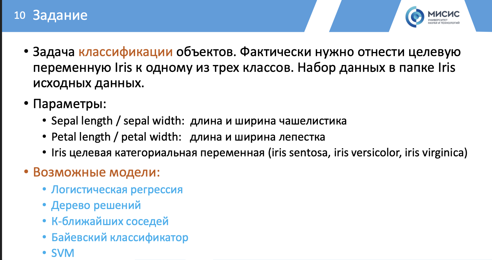

# Проект классификации ирисов

## Описание проекта
Проект по классификации ирисов с использованием трех различных моделей машинного обучения: логистической регрессии, k-ближайших соседей и дерева решений. Цель проекта - определить наилучшую модель для точной классификации ирисов на основе их параметров.

## Понимание проблемы бизнеса
Бизнес-задача данного проекта заключается в построении модели, способной точно классифицировать виды ирисов (Iris-setosa, Iris-versicolor, Iris-virginica) по их параметрам: длина и ширина чашелистика и лепестка. Точная классификация ирисов может быть полезной для ботанических исследований, селекции растений и в других областях, связанных с биологией растений.

# Задание

# Порядок выполнения работы
- Понимание проблемы бизнеса
- Импорт данных и требуемых библиотек
- Очистка данных, восстановление, если необходимо пропущенных данных
- Проверка распределения данных с использованием статистических методов (например pandas profiling)
- Проведение EDA и визуализация отобранных параметров (влияющих на целевую переменную)
- Разделение набора данных на обучающую и тестовую выборку
- Выдвижение гипотезы о возможных применимых алгоритмах
машинного обучения
-  Обучение выбранных моделей (библиотека sklearn)
- Понимание выбранных параметров моделей, объяснить в
комментариях
- Выполнение классификации или прогноза с использованием выбранной модели и тестовой выборки
- Оценить точность модели с использованием таких метрик как MAE, MSE, построить confusion matrix
- Выбрать наилучшую модель на основе вычисленных метрик

## Необходимые зависимости
Для выполнения кода в проекте необходимо установить следующие библиотеки с использованием pip:
```bash
pip install pandas numpy matplotlib seaborn scikit-learn